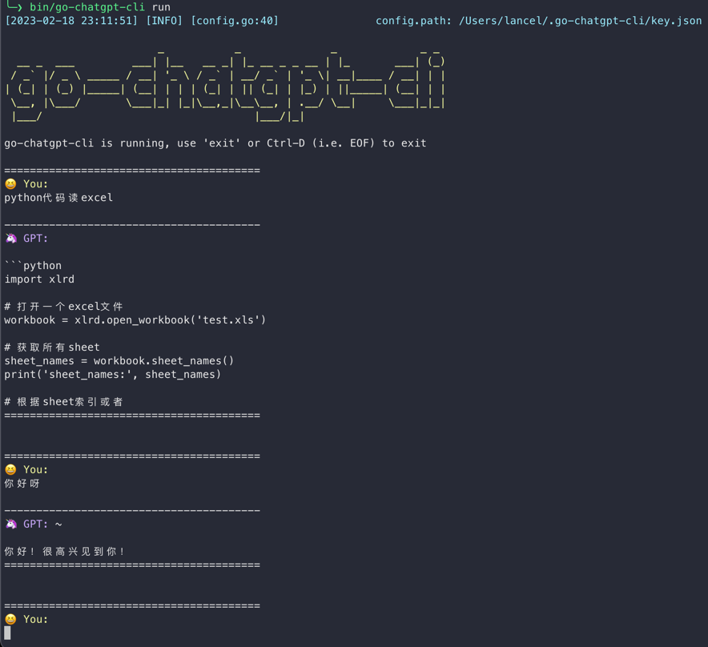

# go-chatgpt-cli

## 效果


## build
```shell
# macOS
make go-build
# linux
make go-build-linux
# windows
make go-build-windows
```
## usage
终端里面输入

```shell
./go-chatgpt-cli set [key]
./go-chatgpt-cli run
```

```shell

# [key] 为你的openAI key
./go-chatgpt-cli.exe set [key]
./go-chatgpt-cli.exe run
```
